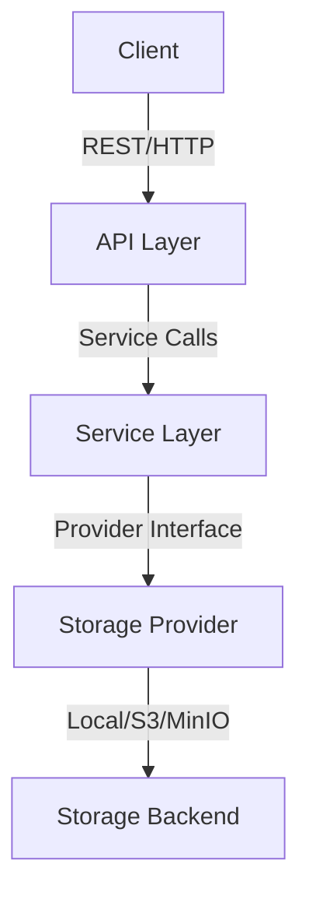

# sereni-storage-provider - Cloud-Native Object Storage Service

**Sereni Storage Provider** is an open-source, enterprise-grade storage platform that provides S3-compatible storage, MinIO support, and local file system integration. Built for scalability and flexibility, it enables developers to manage and store data securely across cloud-native and on-premise infrastructures. With API compatibility, robust access control mechanisms, and a scalable backend architecture, Sereni simplifies storage management for modern, distributed applications.


[](LICENSE)
[](https://golang.org)
[](LICENSE)
[](https://sonar.aptlogica.com/dashboard?id=aptlogica_sereni-storage-provider_268fdb46-e26c-4658-8e95-7ad63d65f666)
[](https://github.com/aptlogica/sereni-storage-provider/actions/workflows/ci.yml)
[](./coverage.html)
[](https://github.com/aptlogica/sereni-storage-provider/releases)
## API Endpoints

All endpoints are prefixed with `/api/v1`.

| Method | Path                  | Description                        |
|--------|-----------------------|------------------------------------|
| GET    | /health               | Health check                       |
| POST   | /storage/upload       | Upload a file                      |
| GET    | /storage/download     | Download a file                    |
| DELETE | /storage/delete       | Delete a file                      |
| GET    | /storage/consumption  | Get file/directory size            |

See [docs/swagger.yaml](docs/swagger.yaml) for full OpenAPI spec and request/response details.

## Architecture Diagram



## How to Contribute

We welcome contributions! Please:
- Read [CONTRIBUTING.md](CONTRIBUTING.md)
- Open issues for bugs/feature requests
- Fork and submit pull requests
- Follow the code style and add tests


## Overview

**sereni-storage-provider** is an enterprise-grade storage backend service and developer storage API engineered for scalability, security, and performance. This comprehensive file storage server and backend file management system features S3-compatible APIs, advanced access control mechanisms, multi-tenant architecture, and seamless integration with modern cloud-native infrastructure, providing backend storage service capabilities, open source file storage for teams, and acting as a storage provider backend for cloud-native apps. Complete storage integration service for file upload applications.

## Key Features

- **S3-Compatible APIs**: Full compatibility with Amazon S3 client libraries and tools
- **Advanced Access Control**: Role-based permissions with fine-grained access policies
- **Multi-Tenant Architecture**: Isolated storage contexts for different organizations
- **High Performance**: Optimized for large file uploads with resumable transfers
- **Data Security**: Encryption at rest and in transit with comprehensive audit logging
- **Storage Microservice**: Complete object storage API with file upload service capabilities
- **Cloud-Native Design**: Kubernetes deployment with auto-scaling capabilities

## Architecture
- Go 1.23+, idiomatic design
- Modular, testable codebase

## Installation
```sh
go get github.com/aptlogica/sereni-storage-provider
```

## Configuration
See `.env.example` for environment variables and configuration options.

## Quick Start

```go
package main

import (
    "context"
    "log"
    "os"
    
    "github.com/aptlogica/sereni-storage-provider/pkg/client"
    "github.com/aptlogica/sereni-storage-provider/pkg/config"
)

func main() {
    // Initialize configuration
    cfg := config.New()
    cfg.StorageBackend = "s3"
    cfg.S3Endpoint = "https://s3.amazonaws.com"
    cfg.S3Region = "us-east-1"
    cfg.S3AccessKey = "your-access-key"
    cfg.S3SecretKey = "your-secret-key"
    
    // Create storage client
    client, err := client.New(cfg)
    if err != nil {
        log.Fatal("Failed to create client:", err)
    }
    defer client.Close()
    
    // Upload a file
    file, err := os.Open("example.txt")
    if err != nil {
        log.Fatal("Failed to open file:", err)
    }
    defer file.Close()
    
    ctx := context.Background()
    result, err := client.Upload(ctx, "my-bucket", "example.txt", file)
    if err != nil {
        log.Fatal("Failed to upload file:", err)
    }
    
    log.Printf("File uploaded: %s", result.URL)
}
```

## Development

### Local Setup
```bash
# Clone the repository
git clone https://github.com/aptlogica/sereni-storage-provider.git
cd sereni-storage-provider

# Install dependencies
go mod download

# Set up environment
cp .env.example .env
# Configure your storage backend in .env

# Start MinIO for local development (optional)
docker run -d \
  -p 9000:9000 -p 9001:9001 \
  --name minio \
  minio/minio server /data --console-address ":9001"

# Start development server
go run ./cmd/server
```

### Environment Configuration
```bash
STORAGE_BACKEND=s3
S3_ENDPOINT=http://localhost:9000
S3_REGION=us-east-1
S3_ACCESS_KEY=minioadmin
S3_SECRET_KEY=minioadmin
MAX_FILE_SIZE=100MB
PORT=8080
LOG_LEVEL=debug
```

### Storage Backends
```bash
# Local filesystem
STORAGE_BACKEND=local
LOCAL_STORAGE_PATH=./uploads

# Amazon S3
STORAGE_BACKEND=s3
S3_ENDPOINT=https://s3.amazonaws.com

# MinIO (S3-compatible)
STORAGE_BACKEND=s3
S3_ENDPOINT=http://localhost:9000
```

## Testing
- Run `go test ./...` to execute unit tests

## Security
See [SECURITY.md](SECURITY.md) for reporting vulnerabilities.

## License
MIT License. Copyright (c) 2026 Aptlogica Technologies.
